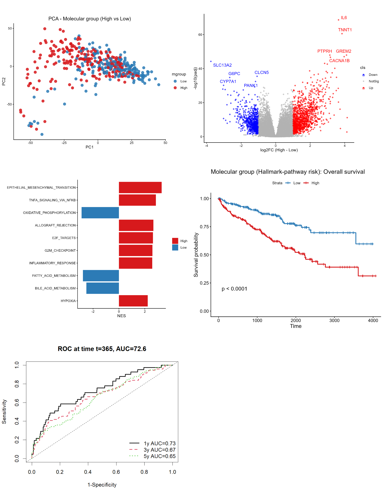

# TCGA-KIRC Hallmark Survival Modeling

[]()
[]()

## Overview

This repository implements a fully reproducible computational oncology pipeline for molecular risk stratification in **TCGA Kidney Renal Clear Cell Carcinoma (KIRC)**.

The project integrates pathway-level activity scoring, survival modeling, validation, and downstream biological characterization.

---

## Objectives

- Quantify Hallmark pathway activity using **ssGSEA**
- Identify prognostic pathways via **Cox regression**
- Build a regularized (**LASSO**) survival model
- Construct a molecular risk score
- Validate discrimination, calibration, and proportional hazards assumptions
- Characterize tumor biology using **DESeq2** and **GSEA**

---

## Dataset

| Variable | Value |
|----------|-------|
| Cohort | TCGA-KIRC (Primary Tumor) |
| Patients | 437 |
| Events | 125 |
| Median follow-up | ~1140 days |
| RNA-Seq | STAR counts |
| Clinical covariates | Age, AJCC stage |

Data accessed using `TCGAbiolinks`.

---

## Molecular Risk Model

Adjusted Cox model:
Surv(time, event) ~ pw_risk + age + stage

### Results

| Variable | HR | p-value |
|----------|----|---------|
| Molecular risk | 2.61 | 2.1e-10 |
| Age | 1.038 | <1e-5 |
| Stage (Late vs Early) | 2.72 | <1e-7 |

**Concordance index (C-index): 0.775**

The model demonstrates strong discrimination.

---

## Validation Strategy

✔ Train/Test split (70/30, no data leakage)  
✔ Time-dependent ROC (1y / 3y / 5y)  
✔ Bootstrap calibration (rms + PEC)  
✔ Proportional hazards testing (Schoenfeld residuals)  
✔ LASSO feature selection stability (50 bootstrap resamples)

---

## Feature Stability

Pathways selected in 100% of bootstrap resamples:

- HALLMARK_BILE_ACID_METABOLISM  
- HALLMARK_UNFOLDED_PROTEIN_RESPONSE  

---

## Differential Expression Analysis

High vs Low molecular risk comparison:

- Significant DEGs: **1965**
- Adjusted for age and stage
- Downstream Hallmark GSEA performed

---

## Pipeline Overview


---

## Summary Panel



---

## Reproducibility

- All random seeds fixed
- sessionInfo saved
- Bootstrap validation included
- Modular R scripts
- MIT License

To run the full pipeline:

```r
source("scripts/run_all.R")
Author
Somayeh Sarirchi
Computational Oncology / Bioinformatics
